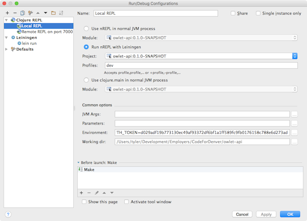

# owlet-api

[](https://codeclimate.com/github/codefordenver/owlet-api)
[](https://codeclimate.com/github/codefordenver/owlet-api)

**generated using Luminus version "2.9.10.26"**

## SETUP


### Prerequisites:

- Java 1.8 or greater

- You will need [Leiningen][1] 2.0 or above installed.

### Database stuff:

With postgres installed on your system (`brew install postgres`)

- `createdb owlet_dev`
- `createdb owlet_test`
- `touch profiles.clj` (from project root)


- Then populate the contents of `profiles.clj` with:

	```
	{:profiles/dev  {:env {:database-url "jdbc:postgresql://localhost/owlet_dev?user=postgres&password=password"}}
	 :profiles/test {:env {:database-url "jdbc:postgresql://localhost/owlet_test?user=postgres&password=password"}}}
	```
- Migrate all outstanding migrations 
	
	`lein migratus migrate`

	
### Environment Variables:

- export OWLET_CONTENTFUL_MANAGEMENT_AUTH_TOKEN="ask a cfd member"
- export OWLET_CONTENTFUL_DELIVERY_AUTH_TOKEN="ask a cfd member"
- export OWLET_CONTENTFUL_DEFAULT_SPACE_ID="ask a cfd member"
- export OWLET_ACTIVITIES_CONTENTFUL_DELIVERY_AUTH_TOKEN="ask a cfd member"

[1]: https://github.com/technomancy/leiningen

### Running: 

To start a web server for the application, run:

    lein run
    

### Dev Workflow Notes:

#### ngrok

During developement you probably want to proxy request from and to `localhost`
to contenful. For this you can use something like [ngrok](https://ngrok.com/)
to tunnel the webhook responses:

with ngrok installed (`brew cask install ngrok`)

then `cd` into **/owlet-api** directory

```
lein run
ngrok http 3000 
```

then finally copy and paste the ngrok url into **contentful.com** webhooks admin page.

#### Cursive

To work with Clojure and ClojureScript on this project, all you really need is
a command line, a browser, and any text editor. However, there is much to be
said for running the Cursive plugin in
[JetBrain's IntelliJ IDEA](https://www.jetbrains.com/idea/). Since it tries
to understand how the different parts of your code and its dependencies connect
together, you can do refactoring, smart code completion, one-click navigation
to a variable definition, instantly view docstrings, catch arity and spelling
errors — all while you type. Best of all, out of the box, you can run a
**R**ead-**E**val-**P**rint **L**oop (REPL) that knows about your code. Quickly
experiment with your live, running code on a command line, then load a change
into the REPL, switch namespaces, or run unit tests with just a couple
keystrokes.

To get started with IntelliJ IDEA and Cursive, follow the
[Cursive installation instructions](https://cursive-ide.com/userguide/).
Then, assuming you were successful with `lein run` above, just
[Import an existing Leiningen project](https://cursive-ide.com/userguide/leiningen.html),
namely owlet-api.

To run owlet-api in Cursive, we'll need to create a
[Run/Debug Configuration](https://www.jetbrains.com/help/idea/2016.1/run-debug-configuration.html).

- First, open IntelliJ and select menu item _Run -> Edit Configurations..._

- Click the **+** icon in the upper left and select item _Clojure REPL_, then
_Local_.

- Give the configuration a name, like "Local REPL".

- Populate the _Environment:_ field by clicking the **...** button on its right
and entering keys OWLET_CONTENTFUL_MANAGEMENT_AUTH_TOKEN, etc., along with
their respective values provided to you by a Code For Denver member.

- Optional: You probably won't need the _Debug_ tool window when you start up
your REPL, so deselect the checkbox _Activate tool window_. You can open it
later if you like.

  The _Run/Debug Configurations_ window should look something like this:

<div style="text-align:center">
  
</div>

  (Note that in this example, there are also a couple additional configurations
listed on the left, "Remote REPL on port 7000" and "lein run". You don't need
to provide these.)

- Click OK to save the configuration and close the dialog.

- Select menu item _Run -> Debug..._ then click on the name you gave you're
configuration ("Local REPL", above).

- You should see the REPL tool window, and the REPL should be ready in half a
minute or so when you see "nREPL server started on port ..." in the REPL
output.

- You can now enter Clojure expressions in the field at the bottom of the REPL
tool window. To evaluate it, hit Command-Return or just Return if the cursor
is at the end of your entered expression. Evaluate the following expression
to start owlet-app:

```clojure
    (clojure.main/main "--main" "owlet-api.core")
```

which results in

    ...
    [2016-07-01 11:35:37,146][INFO][owlet-api.core] #'owlet-api.core/repl-server started
    [2016-07-01 11:35:37,147][INFO][owlet-api.env]
    -=[owlet-api started successfully using the development profile]=-
    => nil

- Use the _Tools -> REPL_ menu to reload the file or just the
expression you edited _while the code is executing_ and see results instantly.
Similarly, you can run all tests for the current namespace or just one.

- Using the REPL menu, you can now change the REPL namespace to one of interest
in the app and experiment with the functions there.

- You can set a breakpoint to halt execution at a particular spot in the code
and step through the execution, check variables, etc.

